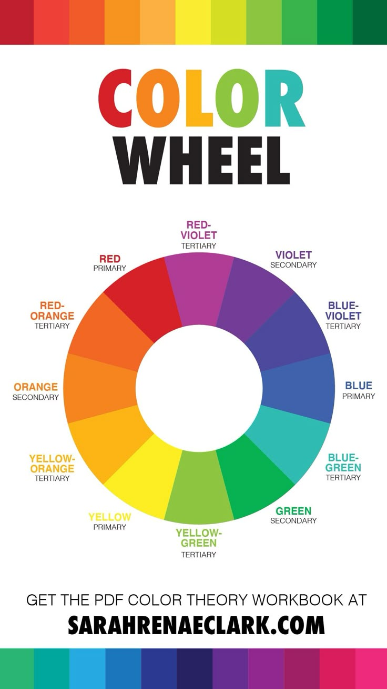

# Diseño para Programadores 

## El proceso creativo.

- Preparacion: Investigar y recopilar información. 

- Incubacion: Experimentar y sintetizar ideas.

- Iluminación: Idear, imaginar.

- Evaluación: Criticar y replantear las ideas concevidas en pasos anterioros

- Implementación: construir sobre las ideas hasta llegar al producto final

## Conceptos basicos de la composición

- Balance: Dado por la posicion de cada elemento dada por su peso visual el cual puede ser simetrico o asimetrico.

- Contraste: Dado por la diferencia entre dos elementos distintos, de color, tamaño, estilo, etc.

- Alineación: Creacion de rutas visuales, horientacion, ordenes de lectura.

- Proximidad: Agrupación de elementos dentro del diseño.

- Repetición: Identidad de marca

- Espacio: Correcto uso del espacio para mejorar la legibilidad.

## Diseño responsivo

Es una metodologia de diseño que nos permite crear diferentes diseños que sean adaptables a distintos tamaños de pantalla.
- tablets
- smartphones
- pc
- televisores
		
### Pasos:

1) Se parte por el diseño para las pantallas mas pequeñas y se va escalando hacia pantallas mas grandes.

2) Separar las capas de contendido y funcionalidad

3) Utilizar sistemas de grilla y columna

### Mejora Progresiva:

Partimos del diseño para la pantalla de celular ya teniendo los elementos basicos definidos. A partir de ahi se pueden ir agregando capas de complejidad encima para ajustar la web al dispositivo del usuario.

### Degradacion Agraciada:

En caso de que el diseño ya exista para un tamaño mas grande y se quiera adaptar a la metodologia responsive se le va quitando complejidad a las versiones mas completas.

## Tips para la accesibilidad del diseño

> Accesibilidad: asegura el acceso a todas las perosnas sin importar alguna discapacidad esencial

- usar los encabezados para organizar la estructura.
- utilizar tamaños de fuente accesible, evitar tamaños pequeños.
- utilizar colores con cotrastes que todos puedan ver. 
- garantizar que el color no sea el unico codigo para relacionar el contenido (usar bordes)
- tener en cuenta los eventos de la pagina, focus, active, hover, etc.
- añadir labels con tiutlos descriptivos a los capmos de los formularios, ayuda a los screen readers
- escribir contenido descriptivo para reemplazar videos o imagenes
- garantizar que las animaciones no bloqueen el contenido

## Brief

> Es la hoja de ruta para empezar a diseñar

### Secciones

- descripcion de la empresa o cliente
- Objetivos y retos
- target o audiencia
- Competencia 
- distribución

Un buen brief debe responder las siguientes preguntas: 

- ¿Cual es la necesidad,desafio o problema a solucionar?
- ¿que se espera lograr?
- ¿a quien se va a impactar?
- ¿Cuales son los beneficios que se van a obtener?
- ¿Como se va a comunicar?

### Tipos de Brief

- creativos: anuncios de tv, via publica, radio.
- publicitario: resume una iniciativa de markenting concreta, lanzamientos, posicionamientos, eventos.
- comunicacion: desarrollo de una estrategia de comunicación, periodistas, influencer, notas.
- diseño: para sitios, newsletters, landigs, incluye info tecnica
- programación: incluye backend y frontend
- negocio: objetivo, publico, posicionamiento, estrategia de marketing, plan de acción

## UX (user experience)

 El diseño UX se encarga del prototipado, la arquitectura de la informacion, las pruebas de diseño y el diseño de la interacción.

El proceso de diseño de la interfaz de usuario se compone por:

#### Investigacion:

> Recopilamos datos de como se comporta el usuario y como usa otras apps similares.

#### Analisis:

> Analizar y agrupar la informacicon segun los objetivos hacia el usuario

#### Diseño:

> Crear prototipos, flujos de usario para visualizar las mejores practicas para el producto final.

#### Pruebas de usuario:

> Se realizan pruebas con sketches para ver como se comporta el usuario con el producto antes de construir el producto y poder hacer ajustes de antemano.

## Diagramas

#### Sitemap

> Es un mapa completo del sitio, aqui se definen secciones principales y secundarias, enlaces a paginas externas.

#### User Flow

> Un diagrama de todos los pasos que realiza un usuario para realizar las diversas acciones, nos ayuda a visualizar las pantallas.

#### Wireframes

> Son planos o bosquejos de la aplicacion, se pueden hacer a mano o mediante programas como figma. La idea es mostrar la estructura que tendra sin muchos detalles ni contenido, pueden hacerse varios que se adapten a distintos dispositivos. Pueden ser de bajo nivel o de alto nivel

## UI (user interface)

> El diseño UI se encarga del diseño visual, los colores, el layout y las tipografias.

### Teoria del color:


> Segun la teoria del color los colores tienen asociaciones psicologicas con ideas o emociones, las marcas los utilizan para transmitir identidad.

tips/buenas practicas para trabajar con colores:
- utilizar formato RGB y hexadecimal
- mantener la consistencia de color entre componentes
- evitar saturacion visual y exceso de colores
- elegir colores legibles para todos los usuarios
	
### Paleta de colores:

> Es un grupo de colores que se utilizara en toda la aplicación. Idealmente se trabajan organizados en un archivo css propio para poder cambiar temas facilmente. es muy util utilizar el circulo cromatico para elegir los colores que la integran

Para armar la paleta hay que tener en cuenta que puede contener:
- colores primarios rojo, verde, amarillo
- colores secundarios, la mezcla entre dos colores primarios
- colores terciarios, mezcla entre un primario y un secundario adyacente



#### Armonias:
- monocromatica: diferentes tonos del mismo color
- análoga: combinacion de colores adyacentes
- complementaria: colores opuestos
- triádica: tres colores equidistantes
- tétrada: cuatro colores que forman un rectangulo, dos primarios y dos secundarios

En la seleccion de los colores de la paleta hay que tener en cuenta tener suficientes para contexto, con variaciones para:
- jerarquia de textos
- estados de interfaz

### Tipografias:

tips/buenas practicas para trabajar con fuentes:
- evitar exeso de familias de fuentes distintas
- priorizar fuentes de sistema
- limitar el volumen de texto para evitar abrumar al usuario
- asegurar que el contenido sea legible en diferentes pantallas
- usar un interlineado que facilite la lectura
- garantizar el contraste entre el texto y el fondo
- evitar animaciones parpadeantes

#### Clasificación de tipografias

Serif:
- Personalidad: Tradicional, seria, respetable, institucional, sofisticada y formal.
- Uso recomendado: Textos largos de párrafo, títulos, logotipos e impresos.
- Ejemplos: Times New Roman, Garamond, Georgia, Book Antiqua, Palatino, Courier.
	
Sans Serif:
- Personalidad: Moderna, limpia, segura, alegre, neutral, minimalista y universal.
- Uso recomendado: Carteles, títulos, textos de párrafo y subtítulos.
- Ejemplos: Arial, Helvetica, Tahoma, Verdana, Bauhaus.
	
Script (Cursiva / Manuscrita):
- Personalidad: Elegante, clásica, afectuosa, creativa y estilizada.
- Uso recomendado: Logotipos, firmas, invitaciones y títulos breves.
- Ejemplos: Lobster, Brush, Great Vibes, Edwardian.
	
Moderna:
- Personalidad: Vanguardista, inteligente, futurista y con estilo.
- Uso recomendado: Aportar un toque innovador o de tendencia.
- Ejemplos: Century Gothic, Futura, Infinity.
	
Decorativa / Display:
- Personalidad: Divertida, casual, única y exclusiva.
- Uso recomendado: Aportar gran personalidad a marcas o elementos puntuales.
- Ejemplos: Amarante, Cherry Squash, Eurostyle.

### Grid Layout:

> Sistema de columnas que ayuda a alinear y organizar componentes y elementos de la interfaz. Garantiza que la estructura visual se adapte a diferentes tamaños de pantalla.

#### Breakpoints:

> Puntos de corte definidos en CSS para aplicar segun anchos de pantalla. Se recomienda utilizar mixins para gestionarlos de forma agil.
	
Escala de breakpoints habitual:
- XS: 360 px (celulares pequeños)
- S: 440 px (celulares grandes)
- M: 768 px (tablets)
- L: 1280 px (pantallas estándar)
- XL: 1440 px en adelante (alta resolución)

#### Propiedades técnicas:

Para activar un contenedor grid se utiliza `display: grid`
Para definir el numero y ancho de las columnas `grid-template-columns`
Para definir el espaciado entre columnas `grid-column-gap`
Para posicionar componentes `grid-column`

Ejemplo de uso:
```
	.grid-container{
		display: grid;
		#la primera columna tiene 200px la segunda 2/3 del espacio sobrante y la tercera 1/3 del espacio sobrante
		grid-template-columns: 200px 2fr 1fr; 
		# equivalente a grid-column-gap/column-gap: 16px + grid-row-gap/row-gap: 16px
		gap: 16px;
	}
	.item1{
		background-color: red;
		# abarca col 1 y 2
		grid-column: 1/3
	}
	.item2{
		background-color: red;
		# abarca col 2 y 3
		grid-column: 2/4
	}

```

### Sistema de componentes UI

> Esta metodologia utiliza un conjunto de elementos modulares que funcionan como libreria interna para construir una aplicacion.

Caracteristicas:
- encapsulamiento: cada componente integra su propia funcionalidad
- independencia del stack: la metodologia es agnostica a la tecnologia, se puede implementar en cualquier framework o arquitectura
- reutilizacion y eficiencia: facilita la importacion de componentes en distintas pantallas promoviendo DRY
- aislamiento de cambios: al eiditar logica o estilos de un componente las modificaciones no afectan a los demas.

#### Workflow Wireframe -\> Componente:

- descomposición: se identifican del wireframe las unidades funcionales independientes
- construccion funcional: se crea antes la estructura y la logica que la capa estetica
- capa visual: se aplican los estilos sobre la estructura ya funcionando

#### Style Guide

> Es una pagina de muestra donde se muestran y documentan todos los componentes. Permite verificar visualmente cómo se comportan las hojas de CSS independientes de cada elemento en un solo lugar.

#### Temas (themes)

Son una capa superficial de color y estilo que aplica variaciones visuales sin modificar la estructura o la logica del codigo base, permite adaptar la apariencia el sitio EJ: modo claro/oscuro. SASS simplifica la gestion de cada variante.

Caracteristicas:
- CSS independientes: un archivo por separado por tema
- Intercambio dinamico: los temas se gestionan desde un archivo central de configuracion de importaciones
- facilidad de mantenimiento: se puede cambiar la apariencia visual solo modificando la referencia al tema importado
- uso de variables: se implementa mediante variables nativas de CSS

### Imagenes

#### formatos web
- JPG/JPEG: compresion con perdida, liviana y optimizada para carga rapida. fotografias e imagenes con degradados complejos.
- PNG: calidad original, mayor peso que JPG. elementos decorativos que requieren fondo transparente. 
- SVG: escalable sin perdida de resolucion, se puede manipular con CSS. Icomos, logotipos y graficos vectoriales/animaciones sencillas.
- GIF: no recomendado, alto peso e impacto negativo en el rendimiento.

#### Criterios de selección visual:
- aporte de valor: elegir imagenes que refuercen o complementen el contenido de la página.
- publico objetivo: utilizar elementos visuales con los que la audiencia se sienta identificada.
- consistencia estetica: mantener una linea grafica acorde a la paleta de colores y al tema de la aplicacion.

#### Rendimiento y accesibilidad:
- evitar texto integrado en imágenes: separar el testo de la imagen para garantizar que los screen readers puedan procesarlo
- optimizacion de dimensiones: exportar las imágenes en el tamaño exacto del contenedor para evitar tiempos de carga extensos y distorsiones visuales
- carga diferida: técnica que aplaza la carga de imágenes hasta que el usuario se desplaza cerca de su posicion, reduciendo tiempo de carga
- texto alternativo: incluir `alt="texto alternativo"` para mejorar accesibilidad visual y el posicionamiento SEO

## Recapitulacion

### Brief: 
#### Definir y tener claros los objetivos del proyecto.

### Sitemap: 
#### Estructurar la arquitectura de la aplicación basándose en los objetivos del brief.

### User Flow: 
#### Mapear los pasos y tareas más comunes que realiza el usuario (diagramas de flujo). Crear tantos como sean necesarios.

### Wireframes de Baja Fidelidad: 
#### Dibujar los bocetos a mano (lápiz y papel) para iterar y modificar rápidamente.

### Wireframes de Alta Fidelidad: 
#### Digitalizar los bocetos validados adaptándolos a distintos dispositivos (escritorio, móvil, etc.).

### Pruebas de Estilo Visual: 
#### Aplicar color, tipografía y diseño visual sobre la estructura base (usando como apoyo el Style Guide y la psicología del color/tipografía).

### Sistemas de Componentes y Variables: 
#### Modularizar el desarrollo en componentes independientes y reutilizables, utilizando variables CSS para gestionar paletas y temas con facilidad.
